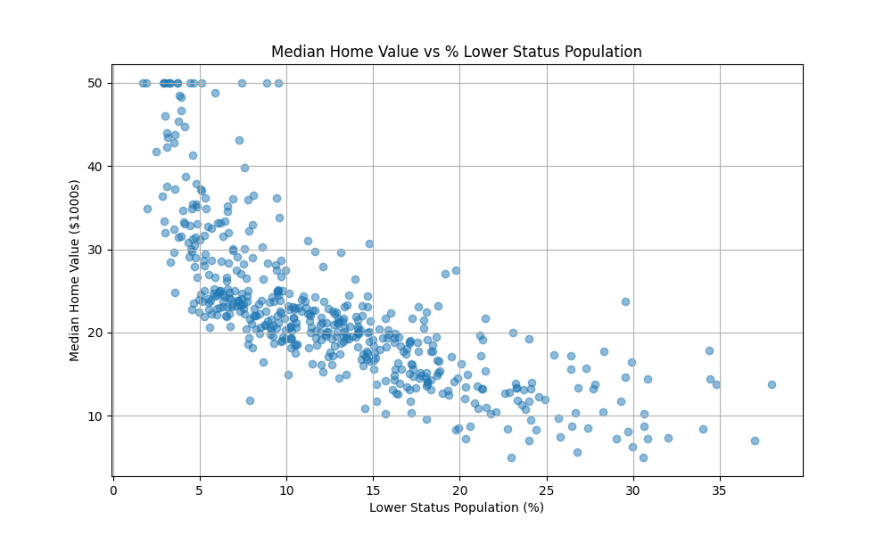
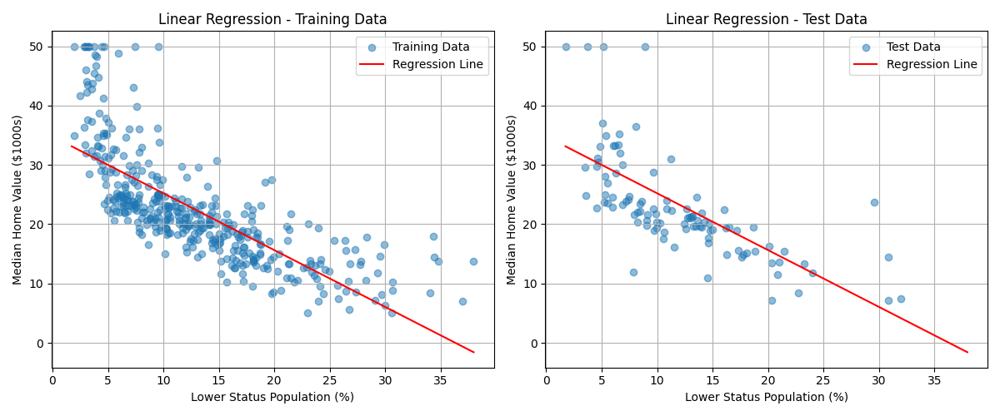
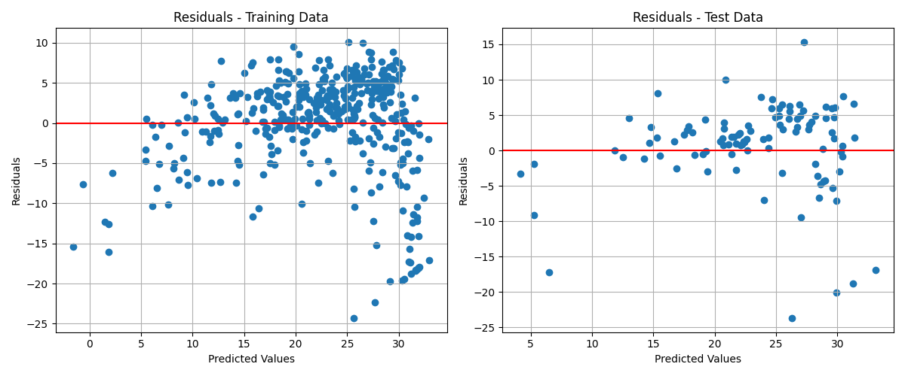
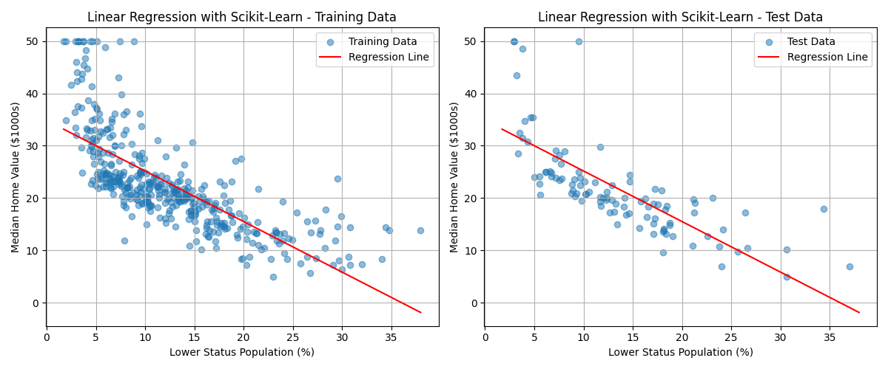
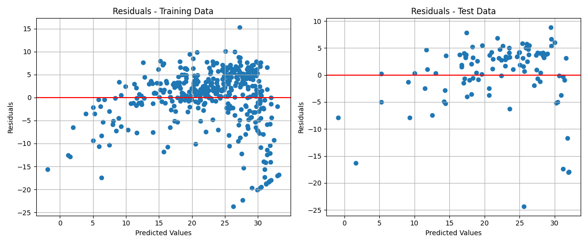
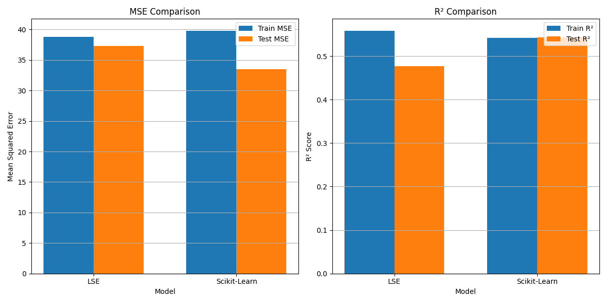

# Linear Regression Modeli Optimizasyonu

## GİRİŞ (INTRODUCTION)

Bu çalışma, YZM212 Makine Öğrenmesi dersi 4. laboratuvar görevi kapsamında gerçekleştirilmiştir. Çalışmanın amacı, doğrusal regresyon modellerini iki farklı yaklaşımla eğitmek ve optimize etmektir. İlk yaklaşımda, Least Square Estimation (En Küçük Kareler Tahmini) yöntemi sıfırdan uygulanarak bir doğrusal regresyon modeli oluşturulmuştur. İkinci yaklaşımda ise aynı veri seti üzerinde Scikit-learn kütüphanesinin sağladığı doğrusal regresyon modeli kullanılmıştır. 

Doğrusal regresyon, bağımlı bir değişken ile bir veya daha fazla bağımsız değişken arasındaki ilişkiyi modellemek için kullanılan temel bir istatistiksel ve makine öğrenmesi tekniğidir. Bu teknik, girdiler ile çıktılar arasında doğrusal bir ilişki olduğunu varsayar ve bu ilişkiyi en iyi şekilde tanımlayan doğrusal denklemi bulmayı amaçlar.

## YÖNTEM (METHODS)

Bu çalışmada Boston Konut Veri Seti kullanılmıştır. Bu veri seti, Boston'daki konutların çeşitli özellikleriyle ilgili bilgileri içerir. Basitlik ve net görselleştirme için, tek bir özellik kullanarak tek değişkenli regresyon gerçekleştirilmiştir: 'lstat' (düşük statüdeki nüfusun yüzdesi) kullanılarak 'medv' (bin dolar cinsinden ev değeri) tahmin edilmeye çalışılmıştır.

### Veri Analizi ve Hazırlama

Veri seti önce temel analizler yapılarak incelenmiş, eksik değer kontrolü yapılmış ve özet istatistikleri hesaplanmıştır. Verilerin genel dağılımını anlamak için görselleştirmeler yapılmıştır.

### En Küçük Kareler Tahmini (LSE) Yöntemi

Least Square Estimation yöntemi, hata karelerinin toplamını en aza indiren parametreleri bulmak için matematiksel bir çözüm sunar. Bu yöntemde kullanılan formül şu şekildedir:

β = (X^T X)^(-1) X^T y

Burada:
- β: Model parametreleri (eğim ve kesişim)
- X: Girdi özellikleri (bir sütun ekstra 1'ler eklenerek)
- y: Hedef değerler
- ^T: Transpoze işlemi
- ^(-1): Matris tersi işlemi

### Scikit-learn Kütüphanesi ile Doğrusal Regresyon

Scikit-learn kütüphanesi kullanılarak aynı veri seti üzerinde doğrusal regresyon modeli eğitilmiştir. Bu yöntem, içerisinde LSE yöntemini barındırmakla birlikte çeşitli optimizasyonlar içerir.

### Model Değerlendirme Metrikleri

Her iki model aşağıdaki metrikler kullanılarak değerlendirilmiştir:

1. **Ortalama Kare Hata (Mean Squared Error - MSE)**: Tahmin edilen değerler ile gerçek değerler arasındaki farkların karelerinin ortalamasıdır. Düşük MSE değeri daha iyi bir model anlamına gelir.

2. **Belirleme Katsayısı (R²)**: Modelin veri üzerindeki açıklayıcılık oranını gösteren bir metriktir. R² değeri 1'e yaklaştıkça model daha açıklayıcı demektir.

## BULGULAR (RESULTS)

İki farklı yaklaşımla eğitilen doğrusal regresyon modellerinin sonuçları aşağıda sunulmuştur.

### En Küçük Kareler Tahmini (LSE) Sonuçları

LSE yöntemi ile eğitilen modelin eğitim ve test veri setleri üzerindeki performansı yukarıdaki grafiklerde gösterilmiştir. Ayrıca, tahmin edilen değerler ile gerçek değerler arasındaki farkları gösteren artık değer grafikleri aşağıda verilmiştir:

LSE modeli için elde edilen metrik değerleri:
- Eğitim MSE: 38.8173
- Test MSE: 37.2706
- Eğitim R²: 0.5577
- Test R²: 0.4766

### Scikit-learn ile Doğrusal Regresyon Sonuçları

Scikit-learn kütüphanesi ile eğitilen modelin performansı yukarıdaki grafiklerde görülmektedir. Bu modelin artık değer grafikleri aşağıda verilmiştir:

Scikit-learn modeli için elde edilen metrik değerleri:
- Eğitim MSE: 39.7604
- Test MSE: 33.5195
- Eğitim R²: 0.5423
- Test R²: 0.5429

### Model Karşılaştırması

Her iki modelin maliyet değerleri (MSE) ve belirleme katsayıları (R²) karşılaştırmalı olarak incelenmiştir:

## TARTIŞMA (DISCUSSION)

Bu çalışmada iki farklı doğrusal regresyon yaklaşımı uygulanmış ve karşılaştırılmıştır. Elde edilen sonuçlar incelendiğinde bazı önemli farklılıklar ve benzerlikler gözlemlenmiştir.

LSE yöntemi ve Scikit-learn ile oluşturulan modellerin eğitim seti üzerindeki performansları incelendiğinde, LSE modelinin eğitim seti üzerinde daha düşük MSE (38.82'ye karşılık 39.76) ve daha yüksek R² değerine (0.558'e karşılık 0.542) sahip olduğu görülmektedir. Bu durum, sıfırdan oluşturulan LSE modelinin eğitim verisine daha iyi uyum sağladığını gösterir.

Öte yandan, test seti üzerindeki performanslar karşılaştırıldığında, Scikit-learn modeli daha düşük MSE (33.52'ye karşılık 37.27) ve daha yüksek R² değeri (0.543'e karşılık 0.477) ile daha iyi bir genelleme performansı sergilemiştir. Bu durum, Scikit-learn modelinin daha iyi genelleme yaptığını ve aşırı uyum (overfitting) problemine karşı daha dirençli olduğunu göstermektedir.

Eğitim ve test performansları arasındaki farklar incelendiğinde, LSE modelinin eğitim ve test performansları arasında daha büyük bir fark olduğu görülmektedir. Bu, LSE modelinin eğitim verisine daha fazla uyum sağlarken genelleme yeteneğinin daha düşük olduğunu gösterir. Scikit-learn modeli ise eğitim ve test performansları arasında daha dengeli bir ilişki sergilemektedir.

Bu farklılıklar, Scikit-learn'ün arka planda kullandığı olası optimizasyonlardan kaynaklanıyor olabilir. Scikit-learn, sayısal hesaplama sırasında daha kararlı algoritmalar kullanarak veya model parametrelerini ayarlarken farklı yaklaşımlar uygulayarak daha iyi genelleme yapan bir model üretmiş olabilir.

Artık değer grafikleri incelendiğinde, her iki modelin de benzer hata dağılımlarına sahip olduğu görülmektedir. Veri setindeki bazı örnekler için tahmin hatası daha yüksek olmakla birlikte, genel olarak hatalar sıfır etrafında rastgele dağılmıştır. Bu durum, doğrusal regresyon varsayımlarının genel olarak karşılandığını göstermektedir.

## SONUÇ (CONCLUSION)

Bu çalışmada, doğrusal regresyon modelinin iki farklı yaklaşımla uygulanması ve sonuçların karşılaştırılması amaçlanmıştır. LSE yöntemi ile oluşturulan model ve Scikit-learn kütüphanesinin sağladığı model arasında bazı performans farklılıkları gözlemlenmiştir.

LSE modeli eğitim verisine daha iyi uyum sağlarken, Scikit-learn modeli test verisinde daha iyi genelleme performansı göstermiştir. Bu durum, Scikit-learn modelinin gerçek dünya uygulamalarında daha kullanışlı olabileceğini göstermektedir. Scikit-learn'ün test verisi üzerinde yaklaşık %10.5 daha düşük MSE ve %13.8 daha yüksek R² değeri sunması, daha güvenilir tahminler yapabileceğinin bir göstergesidir.

İki model arasındaki performans farkı, Scikit-learn'ün arka planda uyguladığı ek optimizasyonlardan kaynaklanabilir. Scikit-learn, sayısal hesaplama sırasında daha kararlı algoritmalar kullanıyor veya model parametrelerini farklı şekilde ayarlıyor olabilir.

Bu çalışma, makine öğrenmesi algoritmalarını sıfırdan uygulamanın ve hazır kütüphaneleri kullanmanın avantaj ve dezavantajlarını görmek açısından öğretici olmuştur. Sıfırdan uygulama, algoritmanın iç çalışmasını anlamak ve kontrol etmek açısından faydalı olurken, hazır kütüphaneler genellikle daha optimize edilmiş ve daha iyi genelleme yapan modeller sunabilmektedir.

Gelecekteki çalışmalarda, çoklu doğrusal regresyon modelleri uygulanabilir veya doğrusal olmayan ilişkileri modellemek için daha karmaşık regresyon teknikleri kullanılabilir. Ayrıca, farklı optimizasyon algoritmalarının (örneğin, gradyan inişi) performansı da incelenebilir.

## KAYNAKLAR (REFERENCES)

1. James, G., Witten, D., Hastie, T., & Tibshirani, R. (2013). An introduction to statistical learning. Springer New York.
2. Scikit-learn: Machine Learning in Python, Pedregosa et al., JMLR 12, pp. 2825-2830, 2011.
3. NumPy: A foundation for scientific computing in Python, Oliphant, Computing in Science & Engineering, 2007.
4. Pandas: A foundational Python library for data analysis and statistics, McKinney, Python for High Performance and Scientific Computing, 2011.
5. Matplotlib: Visualization with Python, Hunter, Computing in Science & Engineering, 2007.